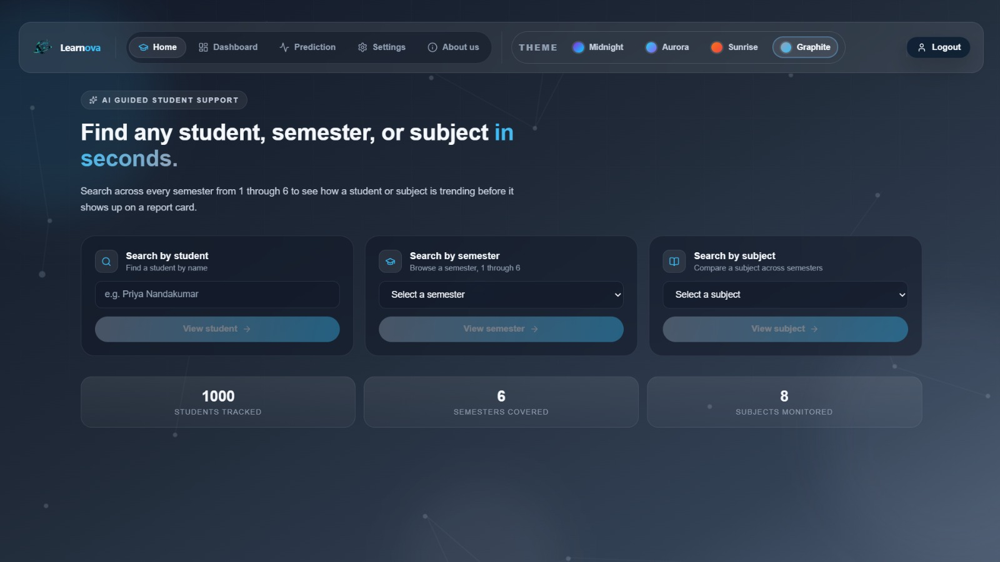
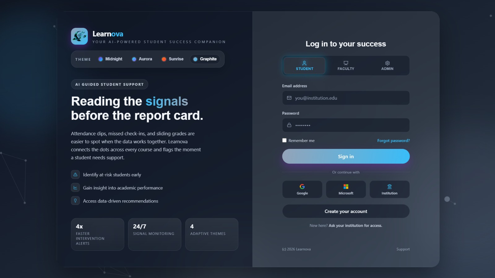
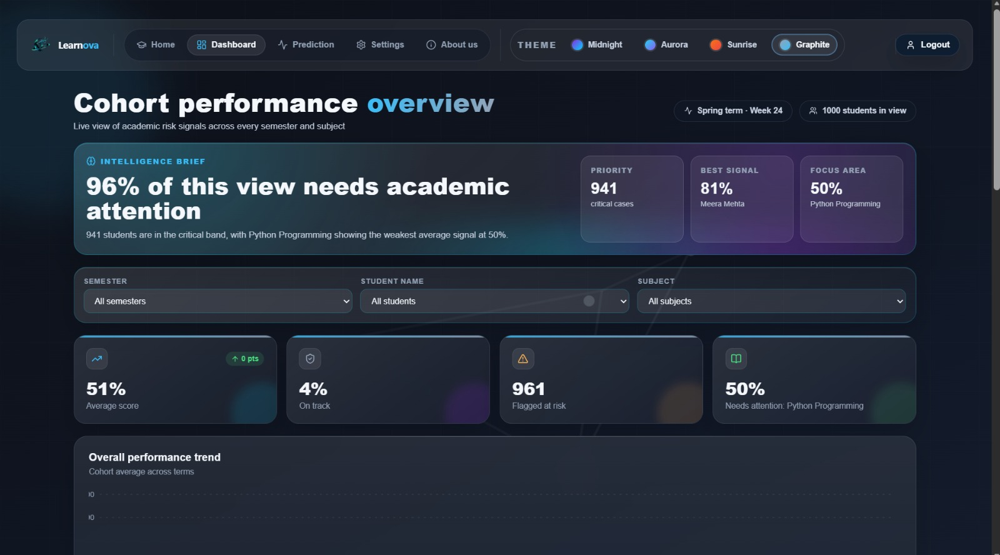
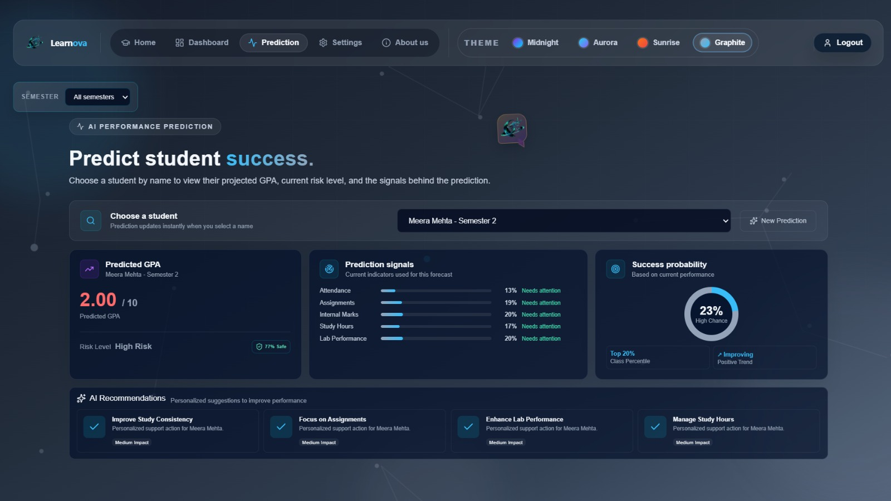
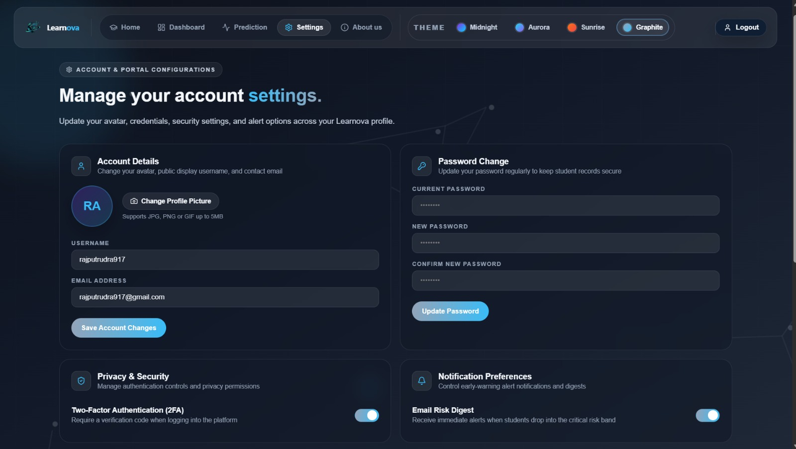

<div align="center">

# 🎓 LearnNova

### AI-Powered Student Success Platform

<p>
  
</p>

<p>
  
  
  
</p>

<p>
  
  
  
</p>

<p>
  📊 <b>Analyze</b>
  &nbsp; • &nbsp;
  🎯 <b>Identify Gaps</b>
  &nbsp; • &nbsp;
  🔮 <b>Predict</b>
  &nbsp; • &nbsp;
  💡 <b>Improve</b>
</p>

</div>

---

## 🌟 About LearnNova

**LearnNova** is an AI-powered Student Success Platform designed to help students understand their academic performance, identify learning gaps, and predict their **upcoming CGPA** using Machine Learning.

The platform combines academic data, Machine Learning, FastAPI, SQL, React, JavaScript, and Node.js to create an interactive student-focused experience.

### 🎯 What LearnNova Does

- 📊 Tracks student academic performance
- 🔮 Predicts upcoming CGPA using Machine Learning
- 🎯 Identifies potential learning gaps
- 📈 Visualizes academic performance
- ⚡ Connects frontend and backend through APIs
- 🗄️ Stores and manages academic data using SQL
- 💡 Provides useful academic insights

---

# ✨ Key Features

<div align="center">

| 📊 Performance Tracking | 🎯 Learning Gap Detection |
|:---:|:---:|
| Monitor academic performance and statistics | Identify areas that need more attention |

| 🔮 Upcoming CGPA Prediction | 🤖 Machine Learning |
|:---:|:---:|
| Predict future CGPA from academic data | ML-powered academic prediction |

| ⚡ FastAPI APIs | 🗄️ SQL Database |
|:---:|:---:|
| Backend API communication | Academic data management |

</div>

---

# 🔮 Upcoming CGPA Prediction

The main feature of LearnNova is its **Machine Learning-based upcoming CGPA prediction system**.

The system processes relevant academic information and uses the ML prediction layer to generate an estimated upcoming CGPA.

```text
              👨‍🎓 Student
                  │
                  ▼
        ┌────────────────────┐
        │ Academic Data      │
        │ Marks / Performance│
        └─────────┬──────────┘
                  │
                  ▼
        ┌────────────────────┐
        │    SQL Database    │
        └─────────┬──────────┘
                  │
                  ▼
        ┌────────────────────┐
        │   FastAPI Backend  │
        └─────────┬──────────┘
                  │
                  ▼
        ┌────────────────────┐
        │ Machine Learning   │
        │      Model         │
        └─────────┬──────────┘
                  │
                  ▼
        ┌────────────────────┐
        │ Upcoming CGPA      │
        │    Prediction      │
        └─────────┬──────────┘
                  │
                  ▼
        ┌────────────────────┐
        │ React Dashboard    │
        └────────────────────┘
````

> ⚠️ The predicted CGPA is an estimate generated by the ML system and is not a guaranteed future result.

---

# 🧠 System Architecture

<div align="center">

```text
┌──────────────────────────────────────────────┐
│                  LEARNNOVA                   │
│       AI-Powered Student Success Platform    │
└──────────────────────┬───────────────────────┘
                       │
                       ▼
              ┌─────────────────┐
              │ React Frontend  │
              │   JavaScript    │
              └────────┬────────┘
                       │
                       ▼
              ┌─────────────────┐
              │   Node.js       │
              │ Application     │
              └────────┬────────┘
                       │
                       ▼
              ┌─────────────────┐
              │ FastAPI Backend │
              │    REST API     │
              └───────┬─────────┘
                      │
             ┌────────┴─────────┐
             │                  │
             ▼                  ▼
      ┌──────────────┐   ┌───────────────┐
      │ SQL Database │   │ ML Prediction │
      │              │   │    Model      │
      └──────────────┘   └───────┬───────┘
                                  │
                                  ▼
                         🔮 Upcoming CGPA
                            Prediction
```

</div>

---

# 🖥️ Screenshots

## 🏠 Home Page

<table>
<tr>
<td align="center">



</td>
</tr>
</table>

<p align="center">
  <b>LearnNova Home & Landing Page</b>
</p>

---

## 🔐 Login Page

<table>
<tr>
<td align="center">



</td>
</tr>
</table>

<p align="center">
  <b>Student Login Interface</b>
</p>

---

## 📊 Student Dashboard

<table>
<tr>
<td align="center">



</td>
</tr>
</table>

<p align="center">
  <b>Academic Performance Dashboard</b>
</p>

---

## 🔮 CGPA Prediction

<table>
<tr>
<td align="center">



</td>
</tr>
</table>

<p align="center">
  <b>Upcoming CGPA Prediction Interface</b>
</p>

---

## ⚙️ Settings

<table>
<tr>
<td align="center">



</td>
</tr>
</table>

<p align="center">
  <b>Application Settings</b>
</p>

---

# 🛠️ Technology Stack

<div align="center">


</div>

<br>

| Layer              | Technology       | Role                                     |
| ------------------ | ---------------- | ---------------------------------------- |
| 🎨 Frontend        | React            | User Interface                           |
| 🟨 Programming     | JavaScript       | Application Logic                        |
| 🌐 Web             | HTML5            | Page Structure                           |
| 🎨 Styling         | CSS3             | UI & Responsive Design                   |
| 🟢 Runtime         | Node.js          | JavaScript Runtime / Application Tooling |
| ⚡ Backend          | FastAPI          | REST APIs & Backend Services             |
| 🗄️ Database       | SQL              | Student Academic Data                    |
| 🤖 ML              | Machine Learning | Upcoming CGPA Prediction                 |
| 🔧 Version Control | Git              | Source Control                           |
| 🐙 Repository      | GitHub           | Collaboration & Deployment               |

---

# 🔄 Data & Prediction Flow

```text
┌───────────────────┐
│   Student Input   │
└─────────┬─────────┘
          │
          ▼
┌───────────────────┐
│ Academic Records  │
└─────────┬─────────┘
          │
          ▼
┌───────────────────┐
│   SQL Database    │
└─────────┬─────────┘
          │
          ▼
┌───────────────────┐
│ FastAPI Processing │
└─────────┬─────────┘
          │
          ▼
┌───────────────────┐
│ Machine Learning  │
│      Model        │
└─────────┬─────────┘
          │
          ▼
┌───────────────────┐
│ Predicted CGPA    │
└─────────┬─────────┘
          │
          ▼
┌───────────────────┐
│ React Dashboard   │
└───────────────────┘
```

---

# 📁 Project Structure

```text
LearnNova/
│
├── studentsuccess-ai-complete/
│   │
│   ├── Frontend/
│   │   ├── React Components
│   │   ├── JavaScript
│   │   ├── CSS
│   │   └── Pages
│   │
│   ├── Backend/
│   │   ├── FastAPI
│   │   ├── API Routes
│   │   └── Backend Services
│   │
│   ├── ML/
│   │   ├── Data Processing
│   │   ├── ML Model
│   │   └── CGPA Prediction
│   │
│   ├── Database/
│   │   └── SQL
│   │
│   └── ...
│
├── dashboard.jpeg
├── home_.jpeg
├── login_.jpeg
├── prediction.jpeg
├── setting.jpeg
│
└── README.md
```

---

# 🚀 Getting Started

## 1️⃣ Clone Repository

```bash
git clone https://github.com/chaurasiyalucky241-cmd/LearnNova.git
```

## 2️⃣ Navigate to Project

```bash
cd LearnNova
```

## 3️⃣ Enter Application Directory

```bash
cd studentsuccess-ai-complete
```

## 4️⃣ Install Dependencies

```bash
npm install
```

## 5️⃣ Start Frontend

```bash
npm run dev
```

## 6️⃣ Start FastAPI Backend

Use the FastAPI entry point configured in the backend.

Example:

```bash
uvicorn main:app --reload
```

---

# 👥 Team LearnNova

LearnNova is a collaborative project developed across **Machine Learning, Backend, Frontend, API, and Database integration**.

<div align="center">

<table>
<tr>

<td align="center" width="33%">

## 🧠 Lucky Chaurasiya

### Project Lead & ML Developer

**Responsibilities**

🤖 Machine Learning
🔮 CGPA Prediction
📊 Academic Data Analysis
🧩 ML Integration
🏗️ Project Architecture
🔗 System Integration

<br>

<a href="https://github.com/chaurasiyalucky241-cmd">

</a>

</td>

<td align="center" width="33%">

## ⚙️ Iamrudrx

### Backend Developer

**Responsibilities**

⚡ FastAPI
🔗 REST APIs
🗄️ SQL Integration
🤖 ML API Integration
🔄 Backend Services
🌐 Frontend–Backend Communication

<br>

<a href="https://github.com/Iamrudrx">

</a>

</td>

<td align="center" width="33%">

## 🎨 sahna4352

### Frontend Developer

**Responsibilities**

⚛️ React
🟨 JavaScript
🎨 UI/UX
📱 Responsive Design
📊 Dashboard
🔗 API Integration

<br>

<a href="https://github.com/sahna4352">

</a>

</td>

</tr>
</table>

</div>

---

# 🤝 Team Workflow

```text
                 🎓 LEARNNOVA
                      │
       ┌──────────────┼──────────────┐
       │              │              │
       ▼              ▼              ▼
  🧠 ML / AI      ⚙️ Backend      🎨 Frontend
       │              │              │
       ▼              ▼              ▼
    Lucky         Iamrudrx       sahna4352
       │              │              │
       ▼              ▼              ▼
 CGPA Model       FastAPI          React
 Data Analysis    REST API         JavaScript
 Prediction       SQL              UI/UX
       │              │              │
       └──────────────┼──────────────┘
                      │
                      ▼
             🚀 LearnNova Platform
```

---

# 🎯 Project Objectives

### 📊 Academic Understanding

Help students understand their academic performance through visual analytics.

### 🔮 Future Performance

Estimate upcoming CGPA using Machine Learning.

### 🎯 Learning Gaps

Highlight areas where students may need additional academic focus.

### 💡 Data-Driven Insights

Convert academic records into understandable information.

### 🚀 Student Success

Give students a centralized platform for monitoring and improving their academic journey.

---

# 🔮 Future Enhancements

* 🤖 AI Student Chatbot
* 📚 Personalized Study Plans
* 📅 Smart Study Scheduler
* 🔔 Performance Notifications
* 🧠 Advanced ML Models
* 📈 Semester-wise Forecasting
* 👨‍🏫 Faculty/Mentor Dashboard
* 📱 Mobile Application
* ☁️ Cloud Deployment
* 📊 Advanced Academic Analytics

---

# 📌 Repository

<div align="center">

<a href="https://github.com/chaurasiyalucky241-cmd/LearnNova">

</a>

</div>

---

### 🎓 LearnNova

**Learn Smarter • Predict Better • Grow Further 🚀**

</div>
```
